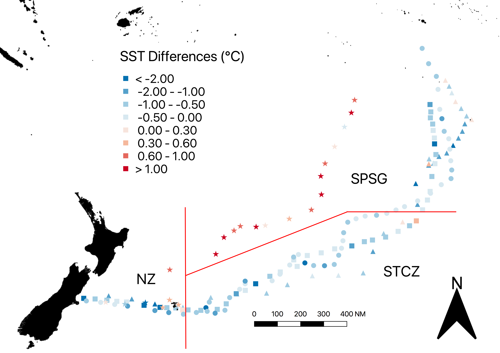
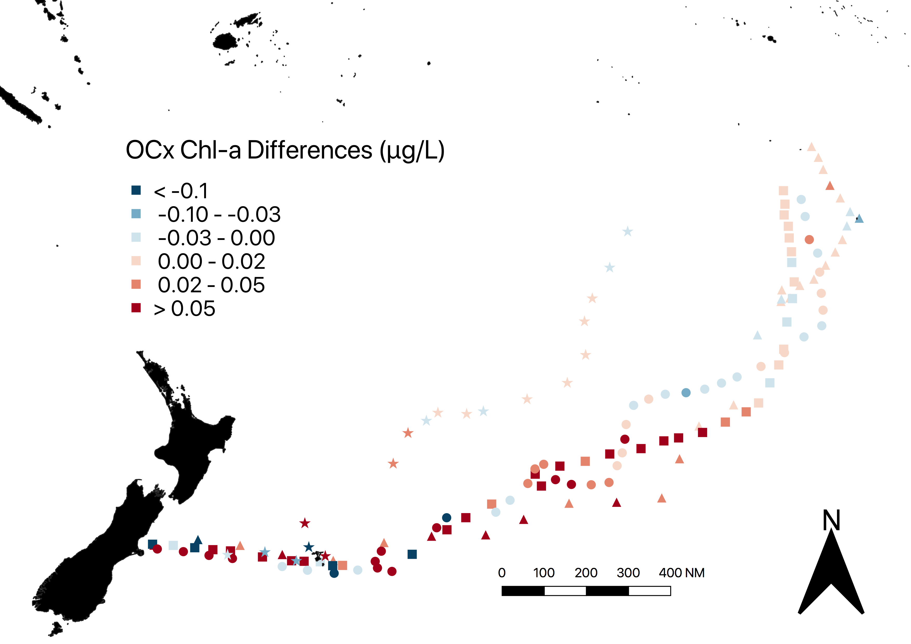

This past Spring Semester, I participated in a study abroad program called SEA Semester, Oceans and Climate hosted by the Sea Education Association in Wood Hole, MA. It involved six weeks of classes on shore, followed by six weeks sailing across the Pacific Ocean in a 136 foot long schooner called the Robert C. Seamans. During the Shore component, myself and a partner developed a research project based on remote sensing, which we were to finish aboard the ship. Below is our abstract, as well as a link to our full research document.

### Abstract

This study verified the reliability of three different MODIS/Aqua satellite based, remote sensing products examining sea surface temperature (SST) and surface chlorophyll-a (chl-a) values within a transect of the South Pacific Ocean stretching from Christchurch, New Zealand to Pape’ete, Tahiti. This transect was further analyzed in terms of the general locales of New Zealand (NZ), Subtropical Convergence Zone (STCZ) and the Southern Pacific Subtropical Gyre (SPSG). The algorithms were verified using in situ measurements from surface samples taken aboard the SSV Robert C. Seamans. The algorithms used were NASA’s Ocean Color Longwave SST product, and the OCx and GSM chlorophyll-a products. The SST algorithm showed strong agreement to the in situ values across all of the locales. The two chl-a algorithms showed more variability than the SST algorithm, with the most variability near the coastal zones of New Zealand, where there are higher chl-a concentrations, and the least variability in the SPSG, where there are lower concentrations of chl-a. The GSM algorithm performed slightly better than the OCx algorithm. These results show that these products can serve to provide researchers and scientists with reliable SST and surface chl-a data for this transect of the South Pacific Ocean, where consistent in situ surface data is not as readily available as other, more well-travelled ocean regions. The high degree of accuracy of the SST algorithm in the SPSG suggests that the SST algorithm would be applicable across the entirety of the SPSG. 

### Accompanying Maps

Below are the maps I created to show the difference between satellite values and in-situ values we analyzed.

