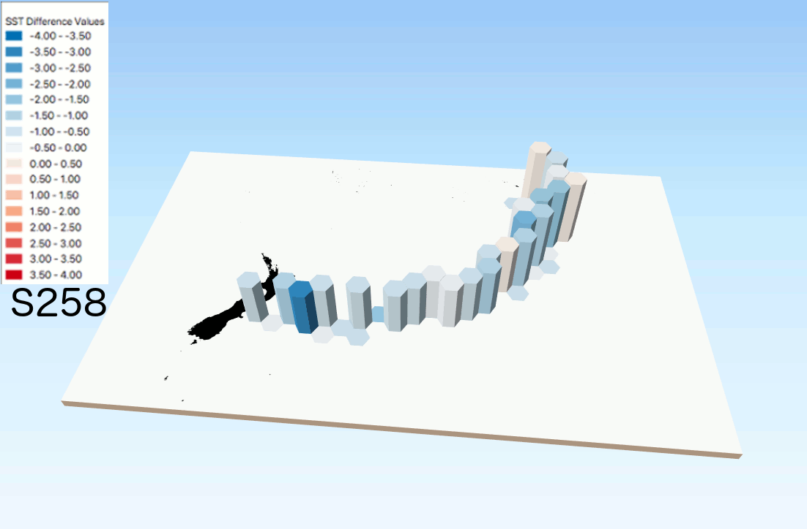
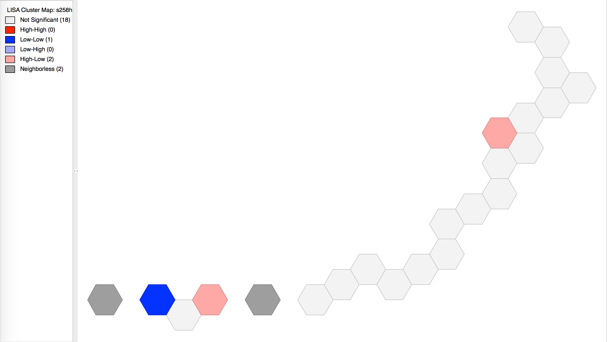
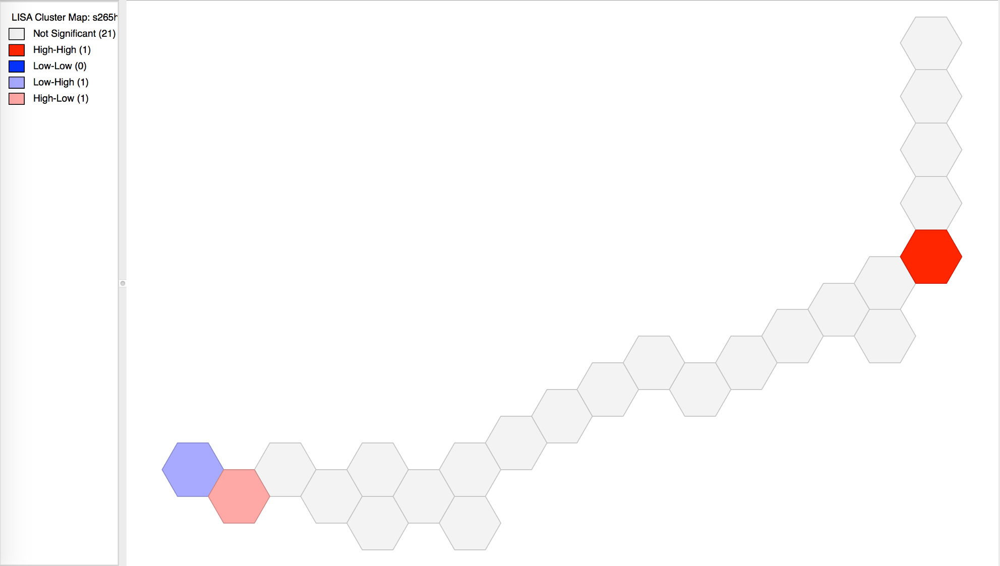
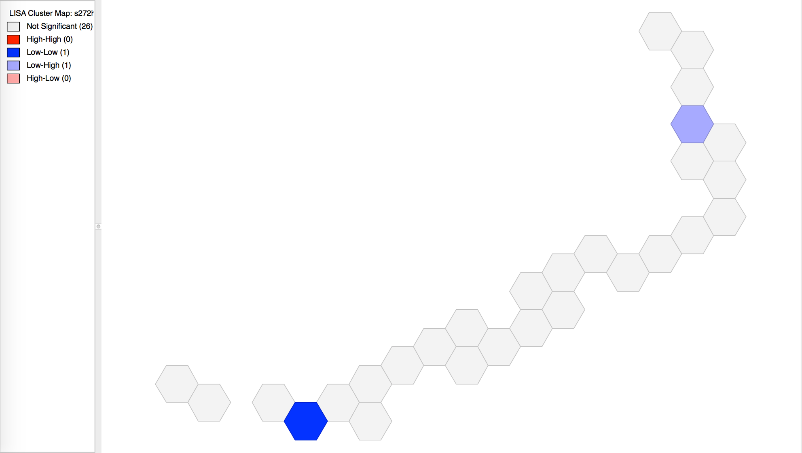

For my final project, I have revisited my project from my study abroad experience, which you can see in my index under SEA Project. I have given the SST map a visual and statistical overhaul, applying a number of things I learned in this class to this map to make it a more appealing and interesting display of data and information. I did remove the data from the S278 cruise track, as the data collected was incomplete at the time of this project. If I had the time, I would go back and reconfigure that set of data to be completely up to date and compare it with the appropriate satellite data.

The overall question of the project was “Are satellite measurements of ocean surface values accurate in the South Pacific?” We answered that question by concluding that, yes, they are accurate in that region, and function as a viable alternative for constantly acquiring in situ data. However, for this iteration and the final project for this class, I suppose the question will be “Can I display this data in a more interesting and eye-catching way using the skills I have learned in this class.” I believe that the answer to that question is "yes".

Below is the map I created, showing the difference (or error) values in the color of hexes, as seen in the legend. The height of the columns shows the temperature as measured by the ship sensors.

Below is additional spatial analysis that I ran on the grids. I used GeoDa to run a monovariable Moran's I. As you can see, there is almost no spatial correlation present in the data. One reason this could be is the linear nature of the measurements. Perhaps a more evident trend would be visible if the data was collected across a wider span of space. This, however, would be extremely time consuming to pull off and is likely not worth the trouble. Another reason this could be the case is that there simply is no spatial reason why the errors are the way they are.

The data I used is either from MODIS Satellite algorithms or directly from the shipboard instruments used on my voyage. I have all of this data saved to my computer via thumb drive directly from the computers recording the data as it was measured.

I went through a number of steps to complete this project, which I will now outline. My first step was to make sure I had all the data I needed and that it was stored somewhere convenient. I took stock of all of my shapefiles and csv files and concluded that I did indeed have everything I would need to move forward. I saved all of the files I needed into a Spatialite database for ease of use over multiple days of work. One of the first obstacles I encountered with this project when I was intially working on it was that the data crossed the 180th meridian, which meant that almost *all* standard map projections would split my data right down the middle. I overcame this issue by projecting everything in Mercator PDC, which comes from the Pacific Disaster Center. This projection is one of the few that is centered around the Pacific Ocean. I also trimmed down my land shapefile so that it only showed the nearby Pacific Islands and New Zealand. Once that was in place, I began implementing my hex grid. I created the grid and then joined each set of cruise track data to the appropriate hexes, taking the mean values of any points that fell within each hex. I then applied a standardized graduated symbology to each set of hexes to allow for easy comparison. Then, using the Qgis2threejs plugin, I added a vertical height to the hexes in each cruise track with the height representing the in situ measured temperature values. After saving each of these as images, I put them together into the GIF file you see above. For the Moran's I maps, I used GeoDa and imported each cruise tracks hex file and ran the statistical analysis on each one.

I chose this component because of my personal connection to it. I am quite proud of this research project and am excited to have the chance to iterate on it further. 

From the proposal: "Some learning challenges that I foresee are managing old data that, quite frankly, may or may not function as I need it to, needing to reproject EVERYTHING into a CRS where the Pacific Ocean is centered, and figuring out what the best way to display a certain kind of data is. Hopefully, I can create something that will last and aid me in my career endeavors in the future."
Yeah pretty much all of that happened. I ran into issues with joining values from various attribute tables at first, but I figured out what needed to be changed (the geometric parameters and the data type).

Overall, I am very, very pleased with how this turned out. It is an intriguing map to look at, and hopefully tells viewers a lot about the kinds of things we were hoping to analyze.
