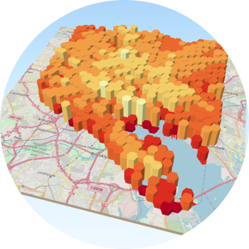
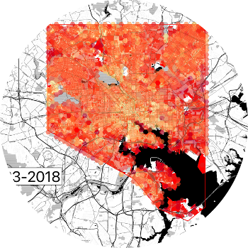
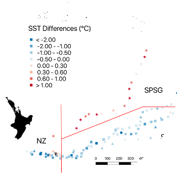

<!--This is the first row of projects -->

### Project 1 

[See more details here.](https://jfreck.github.io/project1/project1.html)

This project focussed on analyzing some part of Baltimore City Property data and displaying it in 3D. I choose to display building age.

<small>__Tools__: QGIS, qgis2threejs plugin, SQL</small>

<small>__Data__: 
Professor Dillon Mahmoudi (ask on Monday for actual source, as its used a lot)

### Project 2

[See more details here.](https://jfreck.github.io/project2/project2.html)

For this project, I continued with my theme of Baltimore City building age, this time with the challenge of creating a time based GIF.

<small>__Tools__: QGIS, GIMP, Python</small>

<small>__Data__:
Dillon Mahmoudi</small>

<!--This is the second row of projects -->

### SEA Semester Project

[See more details here.](https://jfreck.github.io/SEAproject/SEAproject.html)

*I'll do a quick writeup and summary. The linked page will feature the abstract of the paper, and perhaps a link to the larger document somewhere else. I will include all of the maps I created for this project.*

<small>__Tools__: QGIS, Scientific Equipment aboard the Robert C. Seamans Sailing Vessel

<small>__Data__:
*Find SEA Database link and put it here.*

### Final Project 

*Teaser Image Here*

[See more details here.](https://jfreck.github.io/finalproject/finalproject.html)

Pellentesque eget mauris vel mi tristique finibus vitae quis massa. Mauris vulputate, nulla vel tincidunt interdum, sem mauris scelerisque neque, suscipit pellentesque felis augue a erat. 

<small>__Tools__: QGIS

<small>__Data__: 
*Put data here*

