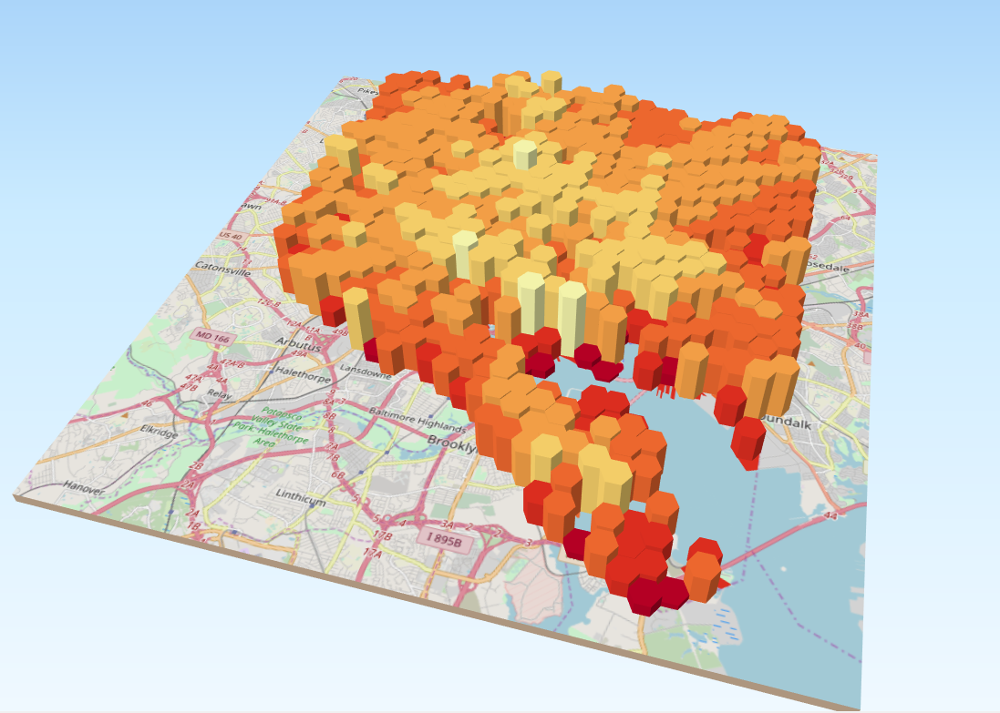

***Average Building Age in Baltimore by Hex-grid***

This map depicts the average age of buildings in Baltimore, as well as the year they were built. For this map, I used a variety of tools and plugins to achieve the final result. The entire project uses the Pseudo Mercator Projection. I began by adding in the shapefile data provided by my professor, then I exported it into a spatialite database. From there, I ran a filter on the layer to get rid of any entry that had a value of zero for the year built, which trimmed down what was processed. I then ran an SQL query ("select objectid, year_build, usegroup, ST_Buffer(GEOMETRY, 0) from property2 where year_build>0") to show only the year_build, objectid, and usegroup categories. I ended up not using the usegroup values, so this could have been left out. After that, I added the query as a new layer. I created centroid points for each layer, then created a hex grid over the map. I counted the number of points in the boundary of each hex, then did the same count function weighted for year_build. I then went into the attribute table and added a new column with the following formula used to fill it: "2018 - (Weight / Count)". This gave me the average age of all the buildings contained within the each hex. I changed the symbology to show this as a gradient. I added an Open Street Map as a base. After that, I used the qgis2threejs plugin to display the map as 3D, with the height set as the expression of the average age. I added an exaggeration of 15 to show the columns more. I made a quick map layout to show the keys and overhead views of the map.

